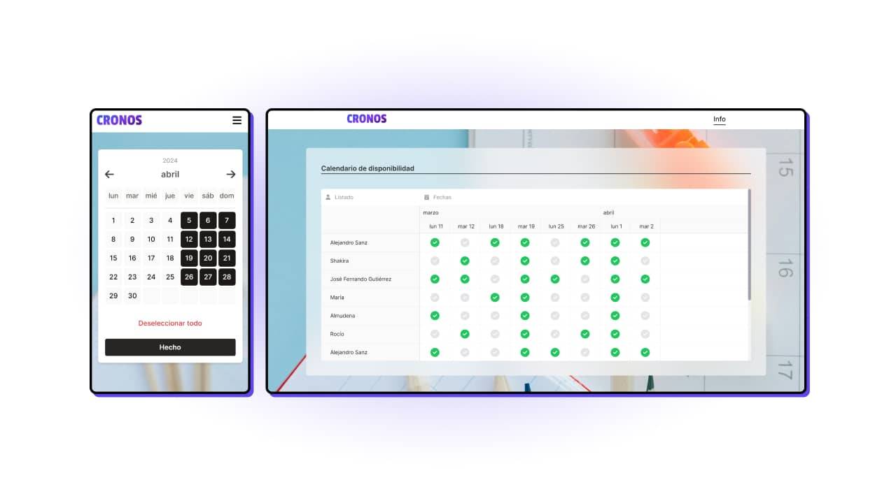

# Cronos

App to quickly check the most suitable date for an event for all (or most) participants. This project came to my mind when I was planning an event. As a group of 6, we were discussing our availability and which date was the best for the event and soon became chaotic. Then, I though to make this process easier.

## Links & credits

| Site                                                                                                                                    |                       Link                        |
| :-------------------------------------------------------------------------------------------------------------------------------------- | :-----------------------------------------------: |
|                                                                     |      [Link](https://cronos-app.vercel.app/)       |
|                                             |       [Link](https://www.michaelmadlos.com)       |
|  | [Link](https://www.linkedin.com/in/michaelmadlos) |
|                                                             |         [Link](https://fontawesome.com/)          |
